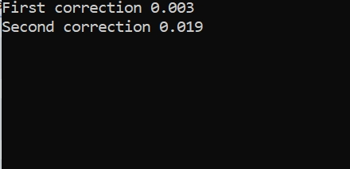

## Работа 1. Тривиальные операции с изображениями
выполнила:  студентка гр.БПМ-17-1 Терентьева П.А.

дата: 24.02.2021

[ссылка на репрозиторий](https://mysvn.ru/pterenteva/Lab_01/)

### Задание
1. Сгенерировать серое тестовое изображение I_1 в виде прямоугольника размером 768х60 пикселя с плавным изменение пикселей от черного к белому, одна градация серого занимает 3 пикселя по горизонтали.
2. Применить  к изображению I_1 гамма-коррекцию с коэффициентом из интервала 2.2-2.4 и получить изображение G_1 при помощи функци pow.
3. Применить  к изображению I_1 гамма-коррекцию с коэффициентом из интервала 2.2-2.4 и получить изображение G_2 при помощи прямого обращения к пикселям.
4. Показать визуализацию результатов в виде одного изображения (сверху вниз I_1, G_1, G_2).
5. Сделать замер времени обработки изображений в п.2 и п.3, результаты отфиксировать в отчете.

### Результаты


Рис. 1. Результаты работы программы (сверху вниз I_1, G_1, G_2)





Рис. 2. Результаты замера времени: First correction - обработка изображения из п.2, Second correction - обработка из п.3

### Текст программы

```cpp
@cpp_source@

#include <iostream>
#include <opencv2/core/core.hpp>
#include <opencv2/highgui/highgui.hpp>
#include <opencv2/imgproc.hpp>
using namespace cv;
using namespace std;

int main()
{
	
	 //ГРАДИЕНТ
	Mat image = Mat::zeros(60, 768, CV_8U);
	for (int i = 0; i < 256; i++) {
		line(image, Point(i * 3, 0), Point(i * 3, 60), Scalar::all(i));
		line(image, Point((i * 3) + 1, 0), Point((i * 3) + 1, 60), Scalar::all(i));
		line(image, Point((i * 3) + 2, 0), Point((i * 3) + 2, 60), Scalar::all(i));
	}
	//imshow("Gradient", image);

	//гамма-коррекция первая
	Mat image1 = Mat::zeros(60, 768, CV_8U);
	float gamma = 2.4;
	clock_t start = clock();
	for (int i = 0; i < 256; i++) {
		float p = pow((i / 255.0), gamma) * 255;
		p = 0.98;
		p = pow((image.at<uchar>(0, i * 3)) / 255.0, gamma) * 255;
		//line(image, Point(i * 3, 0), Point(i * 3 + 3, 60), Scalar(pow(i,0.98)),60);
	/*	line(image, Point(i * 3, 0), Point(i * 3, 60), Scalar::all(pow(i, 0.98)));
		line(image, Point((i * 3) + 1, 0), Point((i * 3) + 1, 60), Scalar::all(pow(i, 0.98)));
		line(image, Point((i * 3) + 2, 0), Point((i * 3) + 2, 60), Scalar::all(pow(i, 0.98)));*/
		line(image1, Point(i * 3, 0), Point(i * 3, 60), Scalar::all(p));
		line(image1, Point((i * 3)+1, 0), Point((i * 3)+1, 60), Scalar::all(p));
		line(image1, Point((i * 3)+2, 0), Point((i * 3)+2, 60), Scalar::all(p));
	}
	clock_t end = clock();
	double seconds = (double)(end - start) / CLOCKS_PER_SEC;
	cout << "First correction " << seconds << endl;
	//imshow("Gamma correction", image1);


	//гамма-коррекция вторая 
	Mat image2 = Mat::zeros(60, 768, CV_8U);
	start = clock();
	for (int i = 0; i < 256; i++) {
		for (int j = 0; j < 60; j++) {
			image2.at<uchar>(j, i * 3) = pow(image.at<uchar>(j, i * 3) / 255.0, gamma) * 255.0;
			image2.at<uchar>(j, (i * 3) + 1) = pow(image.at<uchar>(j, (i * 3) + 1) / 255.0, gamma) * 255.0;
			image2.at<uchar>(j, (i * 3) + 2) = pow(image.at<uchar>(j, (i * 3) + 2) / 255.0, gamma) * 255.0;
		
		}
	}
	end = clock();
	 seconds = (double)(end - start) / CLOCKS_PER_SEC;
	cout << "Second correction " << seconds << endl;
	//imshow("Gamma correction 2", image3);

	//объединение изображений
	Mat image3 = Mat::zeros(120, 768, CV_8U);
	Mat last_image = Mat::zeros(180, 768, CV_8U);

	vconcat(image, image1, image3);
	vconcat(image3, image2, last_image);

	imshow("Concatenation", last_image);
	imwrite("C://Users//user//gradient//first_lab.jpg", last_image);

	waitKey(0);
	return 0;
}


